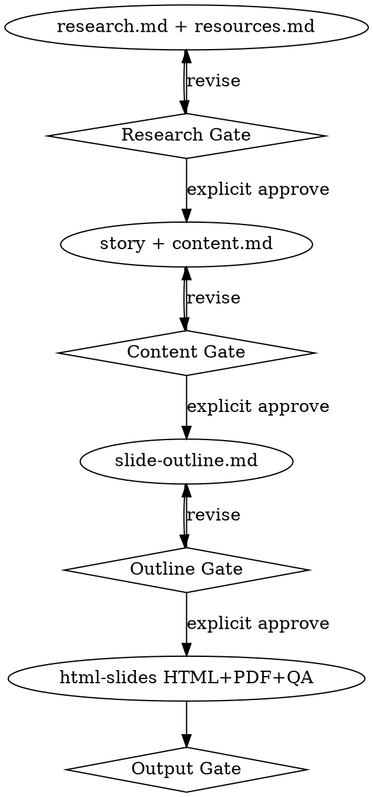

# Building Sharing Decks

Turn raw sharing materials into a reviewed HTML and PDF deck. Work is artifact-first and stage-gated: write the required files, stop, and wait for explicit user approval before the next stage starts.

**Violating the letter of the gates is violating the spirit of the gates.**

This skill orchestrates research, story, content, and outline. It does not replace `html-slides`.

**REQUIRED SUB-SKILL:** Use html-slides for the build stage only, and only after Outline Gate approval.

## When to use

- New sharing, workshop, talk, or presentation from notes, docs, links, image URLs, or an undeveloped topic
- Rebuilding or substantially restructuring an existing sharing
- A request for slides, an HTML deck, a PDF, an outline, or "làm slide" from incomplete materials

Not for: small edits to an already-approved deck (use html-slides alone); uploading, committing, or sending files unless the user asks.

## Directory contract

Root the work at `<topic>/`. Create missing directories. Read existing sources before creating or updating a standard artifact; do not overwrite blindly.

```text
<topic>/
├── sources/
│   ├── research.md
│   ├── resources.md
│   ├── content.md
│   ├── slide-outline.md
│   └── assets/
└── output/
    ├── index.html
    ├── slides.pdf
    └── assets/
```

`<topic>/index.html`, a root-level outline, and speaker `notes.html` are not substitutes for this tree.

Copy exact headings from [artifact-templates.md](references/artifact-templates.md).

## What counts as approval

A gate passes only when the user explicitly approves **that stage's artifacts**.

These are not approval: silence, elapsed time, an end-of-day deadline, "research sau", "license check sau", "cứ dùng lên slide trước", "content viết sau", "đừng hỏi nữa", a manager IM, or "we can fix it later".

If author, date, audience, duration, or central goal is missing, ask. Do not invent them.

## Workflow



### 1. Research package

1. Inspect existing source material and relevant project files.
2. Record audience, duration, claims, demos, and gaps. Ask rather than guessing.
3. Search primary docs, trustworthy articles, data, diagrams, and images.
4. Download only reusable visuals into `sources/assets/`.
5. Log every resource in `sources/resources.md` with the template fields: title, URL, publisher/author, type, license/status, local file, intended use, retrieval date, used on slides.
6. Write `sources/research.md`: inventory, verified facts with citations, examples, contradictions, missing information, questions.
7. **Stop.** Request Research Gate approval of `research.md` and `resources.md`.

If research tools or network access are unavailable, document the gap in `research.md` and stop at this gate.

A resource whose reuse rights are unknown, incompatible, or unchecked stays a reference. Do not copy it into `output/` or embed it in slide HTML. Recreate an original qualitative diagram, or wait for a user-supplied replacement.

### 2. Brainstorm and content

After Research Gate approval:

1. Ask **one question at a time** for audience, duration, goal, depth, takeaway, demos, and constraints.
2. Propose two or three story flows with trade-offs and a recommendation.
3. Obtain explicit approval of the chosen flow.
4. Write `sources/content.md` from the template: thesis, audience and outcome, narrative arc, sections, teaching content, demos, cited facts, speaker material, closing action.
5. **Stop.** Request Content Gate approval of `content.md`.

### 3. Slide outline

After Content Gate approval, write `sources/slide-outline.md` from the template. Each slide lists number, title, purpose, key message, on-slide content, named html-slides component, sources, demo/code, speaker notes, and duration.

Also include total slide and time budget, section pacing, visual inventory, reusable diagrams, live-demo fallback, and appendix candidates.

Validate narrative continuity, duration, repeated layouts, unsupported claims, and text-heavy slides.

**Stop.** Request Outline Gate approval.

Do not treat html-slides step 1 ("distill a short slide outline") as a substitute for this stage or for the Content Gate.

### 4. Build and verify

After Outline Gate approval:

1. **REQUIRED SUB-SKILL:** Use html-slides.
2. Build `output/index.html` at 1920×1080.
3. Copy only used local assets to `output/assets/`.
4. Render `output/slides.pdf` through Chromium or Playwright print-to-PDF.
5. Visually inspect every slide at full size and a reduced viewport.
6. Verify: no overflow or clipping; readable type; working navigation; valid local paths; meaningful alt text; citation accuracy; no fabricated claims, metrics, logos, or quotes; HTML and PDF contain the same complete slide set.
7. **Stop.** Request Output Gate approval.

If PDF rendering fails: keep the verified HTML, report the concrete renderer error, and do not claim the PDF is complete.

## Upstream changes

If the user changes an approved upstream artifact, return to the earliest affected gate and regenerate every downstream artifact. Do not patch `output/` in isolation when `content.md` or `slide-outline.md` must change.

Audience, duration, or goal changes return to the Content Gate. Preserve the research package unless claims, sources, or visuals also change.

## Failure handling

- Conflicting sources: record the conflict and ask which claim to keep.
- Missing author, date, audience, duration, or goal: ask; do not invent.
- Image cannot be downloaded or licensed: keep the URL in `resources.md`; use an original qualitative visual or a user-supplied file.
- Do not commit or push unless the user explicitly requests it.

## Quick reference

| Stage | Required artifacts | Gate | Next |
| --- | --- | --- | --- |
| Research | `sources/research.md`, `sources/resources.md`, `sources/assets/` | Research | Brainstorm |
| Content | Approved story flow + `sources/content.md` | Content | Outline |
| Outline | `sources/slide-outline.md` | Outline | Build |
| Build | `output/index.html`, `output/slides.pdf`, `output/assets/`, visual QA | Output | Complete |

## Rationalizations

| Excuse | Reality |
| --- | --- |
| "Làm slide luôn, hết ngày phải xong, research sau" | Deadline is not a gate. Write the research package and stop. |
| "A short fact-check, then freeze the outline" | Verification belongs in `research.md`. An outline is a later stage. |
| "You already ordered slides today / no more questions" | That is not Research, Content, Outline, or Output approval. |
| "License check later; cứ dùng lên slide trước" | Unknown license is not a license. Log it; do not embed it. |
| "html-slides is outline → HTML; it has no content.md" | This orchestrator owns the sequence. html-slides runs only after Outline Gate. |
| "Manager said don't ask; write content later" | A manager IM is not user approval of `content.md`. |
| "90 minutes left is build authorization" | Time pressure does not skip a gate. |
| "HTML is the deliverable" | Required output is HTML and PDF plus visual QA. |
| "Assume juniors / 35 minutes from the title" | Ask. Do not invent audience or duration. |

## Red flags

- Starting `content.md` before Research Gate approval
- Writing `slide-outline.md` before Content Gate approval
- Invoking html-slides before Outline Gate approval
- Creating `<topic>/index.html` instead of `output/index.html`
- Downloading or publishing an image without provenance and status in `resources.md`
- Embedding a resource whose `license_status` is unknown, incompatible, or unchecked
- Claiming completion without both HTML and PDF
- Skipping visual inspection of every slide
- Silently continuing after an upstream artifact changes
- Treating silence, a deadline, or "fix later" as approval

## Common mistakes

| Mistake | Correction |
| --- | --- |
| Jump to HTML from messy notes | Research package → stop |
| Provenance in an unnamed notes file | Use `sources/resources.md` template fields |
| Outline from research, `content.md` after HTML | Story + `content.md` → stop → outline → stop → build |
| Follow html-slides from its step 1 | Read html-slides only at build |
| PDF "if time is left" | Render PDF, or report the renderer error |

## Example

User: "Sharing Git rebase for juniors tomorrow 9am. Notes are messy. Làm slide luôn."

You:

1. Create `git-rebase/sources/` and `git-rebase/output/`.
2. Write `research.md` and `resources.md`. Download only reusable assets. Mark unknown-license URLs as references.
3. Stop: "Research package is ready. Approve `research.md` and `resources.md` before story and content."
4. After approval: one question at a time, then 2–3 story flows, then `content.md`, then stop.
5. After content approval: `slide-outline.md`, then stop.
6. After outline approval: html-slides → `output/index.html` + `output/slides.pdf` → QA every slide → stop for Output Gate.
